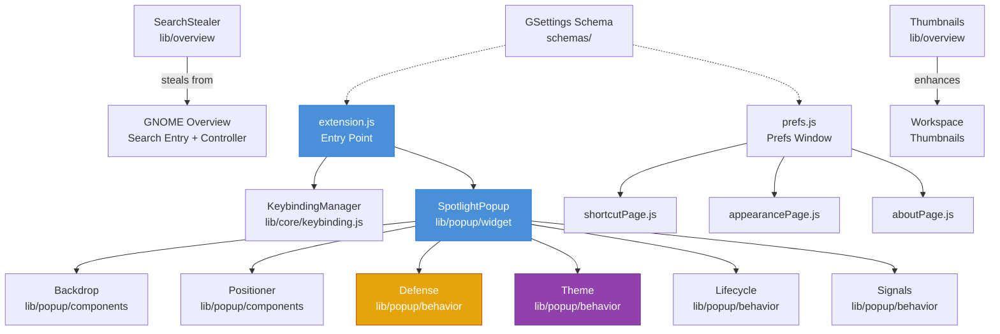

# Contributing to Spotlight

Contributions of all types are welcome — bug fixes, new features, documentation improvements, design proposals, and test reports. Before starting, read this guide and [AGENTS.md](./AGENTS.md) which describes the project's design philosophy, architecture, code style, and verification discipline.

## Prerequisites

- GNOME Shell 45 or later (45, 46, 47, 48, 49, 50, 51 supported)
- Working knowledge of JavaScript and the GNOME Shell extension API
- A **Wayland** session for testing. X11 is not supported and GNOME Shell 50 removed it entirely.
- `nodejs` for syntax checking, `libglib2.0-dev` for schema compilation, `shellcheck` for bash scripts

## Getting Started

```bash
git clone https://github.com/itsnin/spotlight.git
cd spotlight
```

### Install for local testing

```bash
# Build and install a development version
gnome-extensions pack --force --extra-source=lib --extra-source=prefs --extra-source=schemas --extra-source=scripts --extra-source=LICENSE
gnome-extensions install --force spotlight@nin.shell-extension.zip

# Or use the release installer script
scripts/install.sh

# Enable
gnome-extensions enable spotlight@nin
```

Log out and back in on Wayland before enabling.

### View logs

```bash
journalctl -f /usr/bin/gnome-shell | grep -i spotlight
```

## Architecture

Spotlight permanently takes over GNOME Overview's search infrastructure. On enable, it steals the Overview's search entry and search controller widgets. When the popup opens, these already-stolen widgets are reparented into the popup. When the popup closes, they're removed from the popup but kept stolen and hidden. They're only returned to the Overview on disable.

This approach means Spotlight automatically benefits from every search provider registered with GNOME Shell, with zero custom provider code.



### Data Flow

1. **Enable:** `extension.js` creates `SpotlightPopup` and `KeybindingManager`. The popup permanently steals the GNOME Overview search entry and controller.
2. **Shortcut pressed:** `KeybindingManager` catches the accelerator via Mutter's `grab_accelerator`, toggles the popup.
3. **Popup opens:** Stolen widgets are reparented into the popup. Backdrop covers the target monitor. Positioner centers the popup based on empty-state height.
4. **User types:** GNOME search providers feed results into the stolen controller, which renders inside the popup.
5. **Result activated:** Multi-layer close defense fires. Result launches in the appropriate application.
6. **Disable:** Widgets returned to the Overview. All signals disconnected. All main loop sources removed.

## Project Structure

```
spotlight/
├── extension.js              # Entry point, enable/disable lifecycle
├── lib/
│   ├── popup/                # Popup domain, split by responsibility
│   │   ├── widget/
│   │   │   └── spotlightPopup.js   # Main widget, open/close orchestration
│   │   ├── components/
│   │   │   ├── backdrop.js         # Click-outside detection via chrome layer
│   │   │   └── positioner.js       # Sizing, centering, monitor selection
│   │   └── behavior/
│   │       ├── defense.js          # Multi-layer activation close defense
│   │       ├── theme.js            # Light/dark theme decision logic
│   │       ├── lifecycle.js        # Idle scheduling helpers
│   │       └── signals.js          # Global signal connections
│   ├── overview/             # Overview integration domain
│   │   ├── searchStealer.js        # Steal/restore overview search widgets
│   │   └── thumbnails.js           # Thumbnail scale and wallpaper background
│   └── core/                 # Infrastructure
│       └── keybinding.js          # Accelerator grab via Mutter
├── prefs.js                     # Preferences window entry point
├── prefs/
│   ├── shortcutPage.js          # Keyboard shortcut configuration
│   ├── appearancePage.js        # Visual theme preference
│   └── aboutPage.js             # About section
├── schemas/
│   └── *.gschema.xml            # GSettings schema definitions
├── scripts/
│   └── install.sh               # Download and install latest release
├── stylesheet.css               # All styling
├── metadata.json                # Extension manifest
├── AGENTS.md                    # Project rules and architecture reference
├── skills/                      # Focused reference docs per topic
└── .github/                     # CI workflows, issue templates, policies
```

## Code Style

Comments explain the **reasons** rather than just stating the facts. Written in the style of an experienced but lazy senior engineer — natural grammar, capital letters when appropriate, light punctuation only.

**Do:**
```js
// Idle so the activation handler runs first, then we close.
GLib.idle_add(...);
```

**Don't:**
- Banners, JSDoc, or references to other projects
- Phrases like "here we", "let's", "note that"
- Three or more comment lines in a row without intervening code
- Em dashes used as arrow separators
- Unnecessary quotation marks around terms

Read `AGENTS.md` and the `skills/` directory for the full rules.

## Module Design Rules

- **Single responsibility:** Each module does one thing. Stay under ~155 lines.
- **Domain grouping at top level:** `popup/`, `overview/`, `core/`
- **Responsibility sub-grouping within domains:** `widget/`, `components/`, `behavior/`
- **No module-scope objects, signals, or main loop sources:** Only static data structures (arrays, objects, Maps, Sets, RegExps) at file scope.
- **Process isolation:** Shell process never imports `Gtk`, `Gdk`, or `Adw`. Prefs process never imports `St`, `Clutter`, `Meta`, or `Shell`.
- **Signal lifetimes:** `connectObject` for per-open signals that get cleaned together. Plain `connect` with explicit IDs for signals that must persist across open/close cycles. **Never mix lifetimes on the same `(GObject, owner)` pair** — `disconnectObject(owner)` wipes ALL handlers for that owner.

## Testing

### Automated checks

```bash
# JS syntax check (every file)
for f in $(find . -name "*.js" -not -path "./.git/*" -not -path "./skills/*"); do node --check "$f"; done

# Schema compilation
glib-compile-schemas --strict schemas/

# Shell script lint
shellcheck scripts/*.sh

# YAML lint
yamllint .github/ -c .yamllint

# Full CI runs on every PR. The Python validation scripts are inlined
# in .github/workflows/ci.yml (metadata checks, constructor property checks).
```

### Manual testing checklist

Test on at least one supported GNOME Shell version (preferably 50 or 51):

- [ ] Extension enables without errors in journal
- [ ] `Ctrl+Space` opens the popup centered on the correct monitor
- [ ] Typing shows results from at least apps and system actions
- [ ] `Enter` activates a result and closes the popup
- [ ] `Esc` closes the popup
- [ ] Clicking outside closes the popup
- [ ] Opening a web search result closes the popup and focuses the browser
- [ ] `Ctrl+Space` toggles closed when popup is open
- [ ] Preferences window opens and all three pages work
- [ ] Changing shortcut in prefs actually changes the binding
- [ ] Dark/Light/Default theme modes all work
- [ ] Live theme switching works when set to Default
- [ ] Extension disables cleanly, widgets return to Overview
- [ ] Enable → Disable → Enable cycle works without restarting the shell

### Debugging tips

- **Looking Glass:** Press `Alt+F2`, type `lg`, go to Extensions tab. Inspect `Main.extensionManager.lookup('spotlight@nin').stateObj`
- **Nested shell:** Run a nested Wayland session for safer testing: `dbus-run-session -- gnome-shell --nested --wayland`
- **Schema reload:** After changing the schema XML, run `glib-compile-schemas schemas/` and restart the shell
- **Signal leaks:** If you suspect a signal leak, check that every `connectObject` has a matching `disconnectObject` and every plain `connect` has a stored ID that gets `disconnect`ed

## Submitting a Pull Request

1. **Test locally** using the checklist above
2. **Run all automated checks**
3. **Open a PR against the `develop` branch** (not `main`)
4. **Fill out the PR template** completely — every checkbox matters
5. **Keep PRs focused:** One bug fix or one feature per PR. Large changes should be discussed in an issue first.

### PR title format

Use conventional commits style:
- `fix: prevent window-created signal from being wiped on close`
- `feat: add live theme switching`
- `docs: expand contributing guide with testing checklist`
- `refactor: reorganize lib into popup/overview/core domains`

## Reporting Bugs

Open an issue on GitHub with:

- GNOME Shell version (`gnome-shell --version`)
- Linux distribution and version
- Display server (Wayland, which is required)
- Exact steps to reproduce
- Relevant log output: `journalctl -b /usr/bin/gnome-shell | grep -i spotlight`
- Screenshots or screen recordings when helpful

## Proposing Features

Open a feature request issue describing:
- The problem you're solving
- Your proposed solution
- Why it belongs in Spotlight rather than a separate extension

## Review Standards

Every PR gets reviewed against these criteria:
- **Correctness:** Does it do what it claims? No regressions?
- **Lifecycle symmetry:** Every create has a destroy, every connect has a disconnect, every add has a remove
- **Process isolation:** No cross-process imports
- **Code style:** Comments explain why, no LLM phrases, no 3+ comment lines in a row
- **Single responsibility:** New modules stay focused and reasonably sized
- **Documentation:** AGENTS.md, skills, and README updated when architecture or design changes

The skills directory is the reference for all technical standards. Reviewers will check against it.
