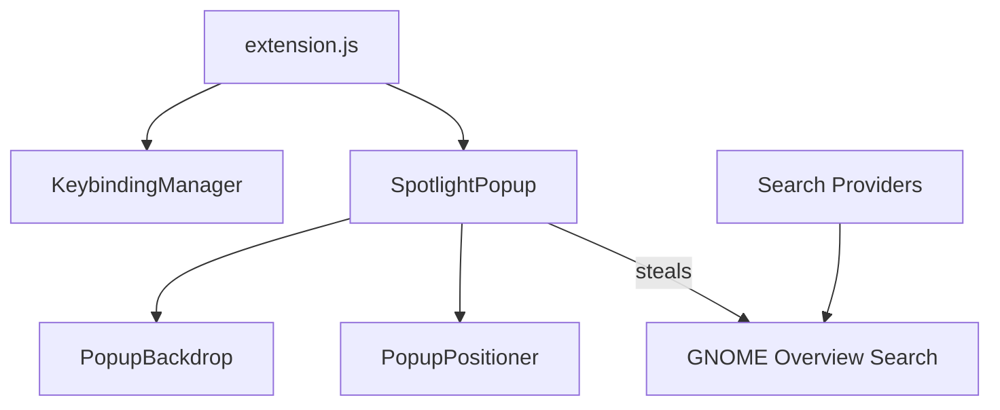

# Contributing to Spotlight

## Coding Standards

Read these before submitting:
- **AGENTS.md** — project rules and architecture
- **skills/extension-best-practices/SKILL.md**
- **skills/extension-lifecycle/SKILL.md**
- **skills/extension-signal-cleanup/SKILL.md**
- **skills/extension-gsettings/SKILL.md**
- **skills/extension-prefs/SKILL.md**
- **skills/extension-esm-imports/SKILL.md**
- **skills/extension-review-guidelines/SKILL.md**
- **skills/extension-writing-standards/SKILL.md**

## Architecture Overview



Spotlight permanently steals the GNOME Overview search widgets on enable. The popup reparents them when opened. This gives Spotlight access to all GNOME search providers with zero custom code.

## Before Submitting

```bash
# JS syntax
for f in $(find . -name "*.js" -not -path "./.git/*" -not -path "./skills/*"); do node --check "$f"; done

# Schema
glib-compile-schemas --strict schemas/
```

Verify the PR template checklist. Test on GNOME Shell 45-51 Wayland.

## Crash Reports

```bash
journalctl -b /usr/bin/gnome-shell | grep spotlight
```

## Commit Messages

Imperative mood. Reference the component. Examples:
- `Popup: fix activation close on middle click`
- `Docs: update architecture diagram`
- `CI: add shellcheck validation`
