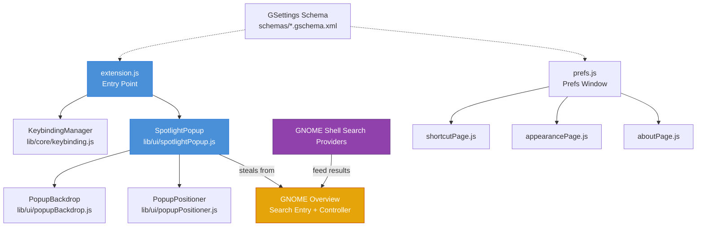

# Contributing to Spotlight

## Prerequisites

GNOME Shell 45 or later, working knowledge of JavaScript and the GNOME Shell extension API, and a Wayland session for testing since X11 is not supported.

## Getting Started

```bash
git clone https://github.com/itsnin/spotlight.git
cd spotlight
```

Install for testing:
```bash
scripts/build.sh
gnome-extensions enable spotlight@nin
```

Log out and back in on Wayland before enabling.

## Architecture



### Data Flow

1. **Enable:** `extension.js` creates `SpotlightPopup` and `KeybindingManager`. The popup permanently steals the GNOME Overview search entry and controller.
2. **Shortcut pressed:** `KeybindingManager` catches the accelerator, toggles the popup.
3. **Popup opens:** Stolen widgets are reparented into the popup. Backdrop and positioner handle placement.
4. **User types:** GNOME search providers feed results into the stolen controller, which renders inside our popup.
5. **Result activated:** Popup closes. Result launches in the appropriate application.
6. **Disable:** Widgets returned to the Overview. All signals disconnected.

## Project Structure

```
spotlight/
├── extension.js              # Entry point, lifecycle management
├── lib/
│   ├── ui/
│   │   ├── spotlightPopup.js    # Main popup widget, open/close/destroy
│   │   ├── popupBackdrop.js     # Click-outside detection via chrome layer
│   │   └── popupPositioner.js   # Sizing, centering, monitor selection
│   └── core/
│       └── keybinding.js        # Accelerator grab via Mutter
├── prefs.js                     # Preferences window entry point
├── prefs/
│   ├── shortcutPage.js          # Keyboard shortcut configuration
│   ├── appearancePage.js        # Visual theme preference
│   └── aboutPage.js             # About section
├── schemas/
│   └── *.gschema.xml            # GSettings schema definitions
├── scripts/
│   ├── build.sh -> install.sh   # Installer symlink
│   ├── install.sh               # Download and install latest release
│   ├── check-metadata.py        # CI metadata validation
│   └── check-gobject-constructors.py  # CI constructor validation
├── stylesheet.css               # All styling
├── metadata.json                # Extension manifest
└── AGENTS.md                    # Project rules and architecture reference
```

## Code Style

Comments explain the reasons rather than just stating the facts. Written in the style of an experienced but lazy senior engineer, using natural rather than forced grammar and employing capital letters when appropriate. Light punctuation only. No banners, no JSDoc, no references to other projects. No LLM phrases. Maximum two consecutive comment lines without intervening code.

Read `AGENTS.md` and the `skills/` directory for the full rules.

## Testing

```bash
# JS syntax check
for f in $(find . -name "*.js" -not -path "./.git/*" -not -path "./skills/*"); do node --check "$f"; done

# Schema compilation
glib-compile-schemas schemas/

# Full CI checks
python3 scripts/check-metadata.py
python3 scripts/check-gobject-constructors.py
```

Test manually on GNOME Shell 45-51 Wayland.

## Submitting

1. Test locally
2. Run CI checks
3. Open a pull request against the `develop` branch

## Reporting Bugs

Open an issue on GitHub with:
- GNOME Shell version
- Linux distribution
- Steps to reproduce
- `journalctl -b /usr/bin/gnome-shell | grep spotlight`
